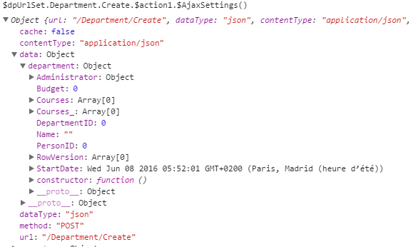
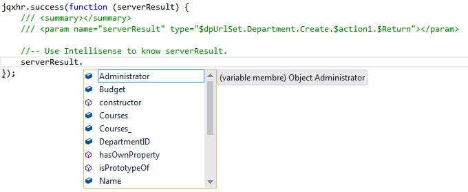

# +[Diphap.JsNetBridge.Mvc](https://www.nuget.org/packages/Diphap.JsNetBridge.Mvc)+

## [Getting Started Guide](Getting-Started-Guide) | [Package Nuget ](-Download) | [Problem Solving](Problem-Solving)

### Presentation
With Intellisense, the library provides information for easy writing to ajax requests for ASP.NET MVC and WEB API applications. 
The advantage is to have no more hard-coded client-side URL.
When writing of ajax requests, the library allows the developer front-end to retrieve the url generated 
on the server side, to know the structure of data to send parameter and instantiate it.

All proxy objects in javascript are generated and available through the Visual Studio Intellisense for the action methods and business objects.
The URL of action method is also generated.

Download a [SAMPLE APPLICATION](https://jsnet.codeplex.com/releases).

Client side with Intellisense, you easily access the parameters of each action method :

Server side:

{code:c#}
public class DepartmentController : Controller
{
        public ActionResult Create([Bind(Include = "Name, Budget, StartDate, PersonID")](Bind(Include-=-_Name,-Budget,-StartDate,-PersonID_))Department department)
        {
            JsonResult result = new JsonResult();
            if (ModelState.IsValid)
            {
                db.Departments.Add(department);
                db.SaveChanges();
                result.Data = department;
            }

            return result;
        }
{code:c#}

 Here is an example of sending a ajax request to invoke the server's action method:

{code:javascript}

//-- get parameters of action method
//-- it references the proxy object '$dp.$JsNet.ContosoUniversity.Models.Department'.
var data = $dpUrlSet.Department.Create.$action1.$Params();

//-- set parameters.
//-- The Intellisense provides auto completion
data.department.Name = 'Maths';
data.department.Budget = 10000;
data.department.StartDate = new Date();
data.department.PersonID = 1;

//-- get ajax settings of action method.
//-- settings.url is predefined ex: '/Department/Create'
var jsonSettings = $dpUrlSet.Department.Create.$action1.$AjaxSettings();
jsonSettings.data = JSON.stringify(data);

//-- send ajax request
var jqxhr = $.ajax(jsonSettings);

jqxhr.success(function (serverResult) {
    /// 

    /// <param name="serverResult" type="$dpUrlSet.Department.Create.$action1.$Return"></param>
    
    //-- Use Intellisense to know serverResult.

});
{code:javascript}

In the console of Chrome web browser, the values of 'AjaxSettings':

Intellisense for 'serverResult':

